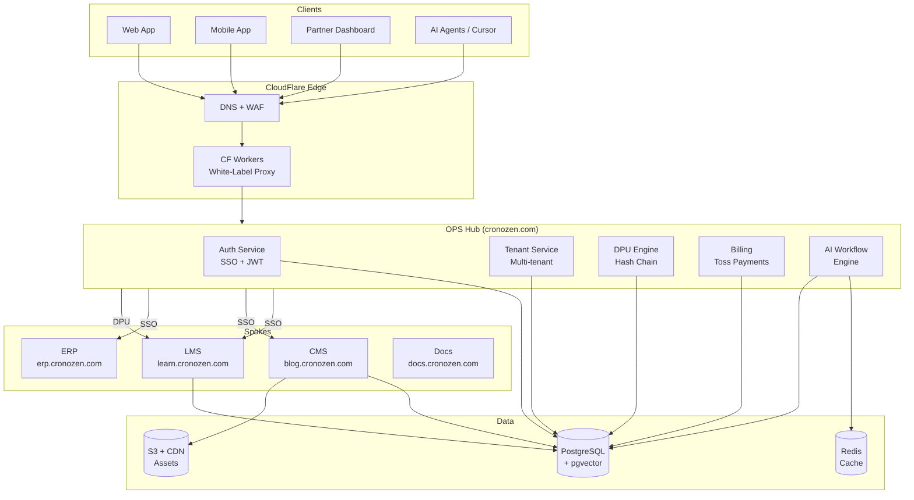
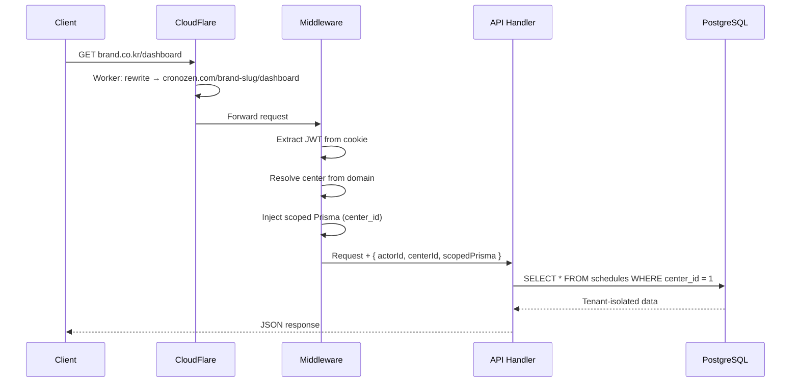
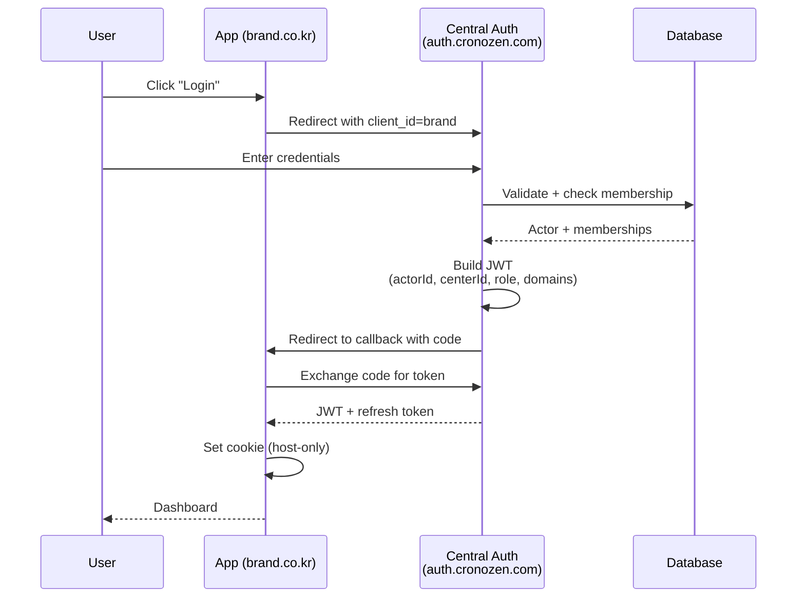
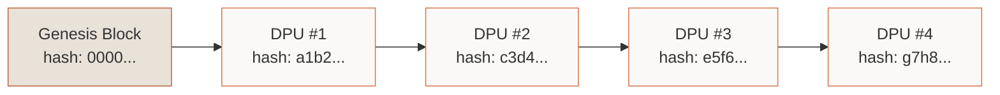
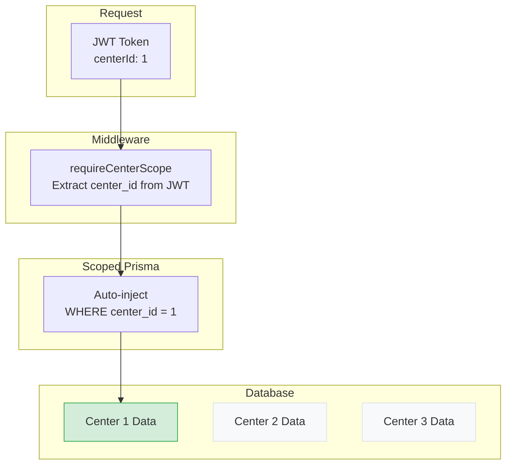
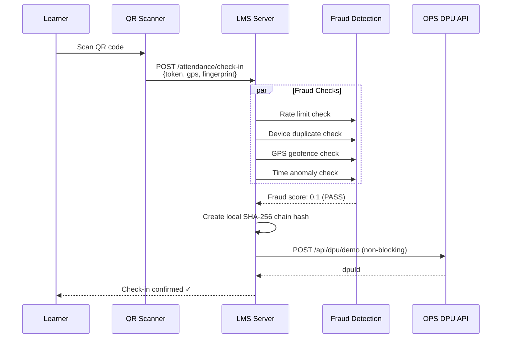
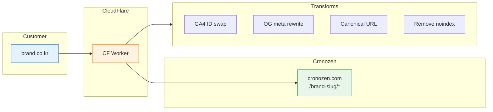

# System Diagram

## Platform Overview



---

## Request Flow



---

## Authentication Flow



---

## DPU Hash Chain



Each block's hash is computed from:
```
SHA-256(content + previousHash + timestamp)
```

Tampering with any record breaks all downstream hashes.

---

## Multi-Tenant Data Isolation



Only Center 1 data is accessible. Centers 2 and 3 are invisible to the current request.

---

## LMS Attendance Proof Flow



---

## White-Label Domain Flow


